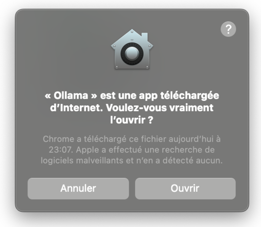
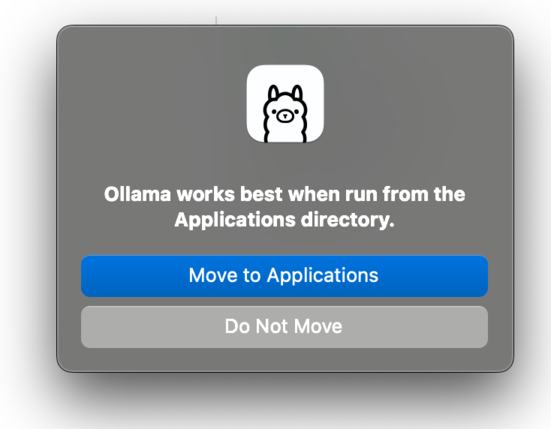
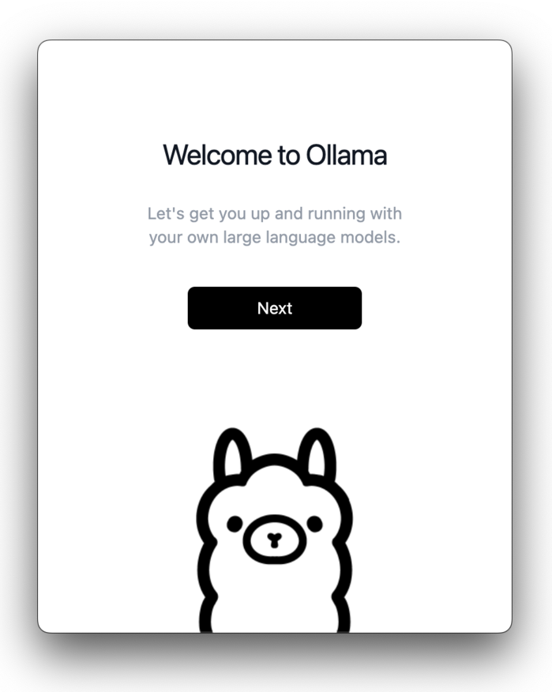
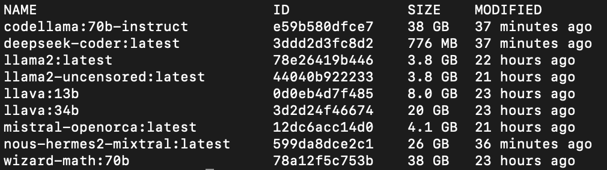

# Introduction

Nous allons découvrir ensemble **l'intelligence artificielle** sur Mac.

## Prérequis

Vous devez avoir un Mac M1. Si vous ne savez pas ce que c'est, visitez [cette page Wikipedia](https://fr.wikipedia.org/wiki/Apple_M1). Si vous n'en avez pas, vous pouvez apprendre la théorie et pas la pratique.

Vous devez avoir envie de découvrire l'intelligence artificielle en utilisation libre et gratuite. Nous allons utiliser l'application Ollama.

Vous devez avoir du temps devant vous, pour avancer pas à pas dans ce site.

Et vous devez avoir quelques notions d'anglais, mais nous traduirons au fur et à mesure tous les termes anglais que nous croiserons, comme [LLM](#LLM)

N'hésitez pas à m'écrire si vous ne comprenez pas une étape, tout est fait pour être très accessible.

C'est parti !

### Installation

Si ce n'est déjà fait, commencez par **[téléchargez Ollama](https://ollama.ai/download)**

Vous avez dans votre dossier téléchargement le fichier Ollama-darwin.zip

Double cliquez dessus (pour décompresser l'application) et déplacez la dans votre dossier applications.

Lancez l'application Ollama,




Un dialogue apparaît pour vous demander de confirmer, car c'est une application chargée depuis l'internet et pas depuis l'AppStore d'Apple. Vous pouvez confirmer.

Ollama se lance et si vous ne l'avez pas déplacé dans le dossier Applications, un dialogue en anglais vous proposera de le faire



Cliquez sur **Move to application**

Un autre dialogue en anglais vous souhaite la bienvenue et vous présente le logo Ollama.



Cliquez sur Next.

## Ouvrir l'application terminal

Pour lancer Ollama et pour charger un premier LLM, il faut lancer l'application Terminal qui se trouve dans le dossier Utilitaire de votre Mac.

Taper dans le terminal la commande:

```bash
ollama run llama2
```

Le mot `run` permet d'executer le modèle `llama2`.

Une fois le modèle téléchargé, vous pouvez commencer une discution.

Pour afficher les modèles installés, taper dans le terminal de commande:

```bash
ollama list
```



Pour proposer une modification, rendez-vous sur le [github de cette page](https://github.com/igorschlum/ollama.fr) puis dans `docs/intro.md` et cliquer sur le petit stylet.
